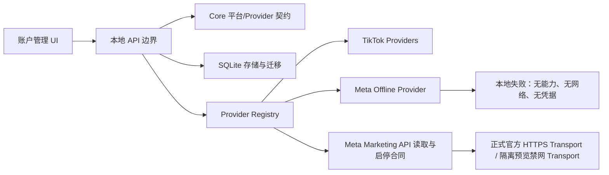

# Meta Ads 离线接入与启停合同架构

状态：内部自用 Meta Marketing API 架构（正式网络能力存在；隔离预览禁网且不启动调度）
核验日期：2026-08-16

## 1. 本阶段目标

在现有 TikTok 自动化系统中保留独立的 Meta Ads 平台边界，并增加 Marketing API 的对象读取与 Campaign、Ad Set、Ad 启停正向合同。客户端可维护共享 App 档案和广告账户绑定，Windows DPAPI 仅保存秘密包。正式 API 进程具备官方 HTTPS Transport 和调度器，但所有 Meta 读写必须经过系统总开关、Meta 运行开关、账户开关、liveMode、能力与对象 allowlist；本轮侧栏隔离预览使用无网络 Provider 且 `startScheduler:false`。

本阶段交付包含可分阶段开放的真实接入能力，但当前侧栏预览只用于本地 UI 与 Fixture 验收，不代表正式客户端或调度器已开启。

## 2. 平台模型

| 维度 | TikTok | Meta（当前） |
|---|---|---|
| `platform` | `tiktok` | `meta` |
| Provider | `cookie` / `official-api` | `meta-offline` / `meta-marketing-api` |
| 实现状态 | `available` | `meta-offline` 为 `scaffolded`；`meta-marketing-api` 为 `available` |
| 能力 | 按连接授权 | 离线 Provider 为空；Marketing API 声明对象读取与三层启停合同 |
| 自动化 | 按账户与能力开放 | 系统总开关 + Meta 运行开关 + 账户开关 + `automation-status` + 能力/层级 allowlist |
| 接入参数/Token | 现有加密流程 | 正向合同可本地保存，Token 不回显 |
| 网络读取/写入 | 现有受控流程 | 正式进程可注入官方 HTTPS Transport；隔离预览不注入 Transport |

关键约束：`meta-offline` 永久保持零能力、零凭据、零网络；`meta-marketing-api` 是另一个显式 Provider，不是 TikTok `official-api` 的别名，也不能通过解除 Meta 409 获得写能力。旧账户没有 `platform` 时兼容推导为 `tiktok`。

## 3. 分层结构

- Core：定义 `PlatformKind`、Provider 与平台映射、Meta 强制停用规则。
- Storage：账户表持久化平台；旧库回填 TikTok；迁移时校验外键。每个 Meta Access Profile 的 App ID 全局唯一，`App Secret + Access Token` 作为一个秘密包进入 Vault；广告账户只保存 `profileId`、Ad Account ID、可选 Page ID、liveMode 与三层 allowlist。
- Provider：离线实现保持零能力；正向 Provider 通过可注入 Transport 验证广告账户、分页映射 Campaign、Ad Set、Ad，并实现 `ACTIVE / PAUSED` 启停合同。每次写入只发送一次，随后必须按对象 ID 回读 `status`；写入后结果不明或回读不一致统一标记为 `unknown`，不得自动重放。正式 API 可注入官方 HTTPS Transport，隔离预览明确不注入。
- API：提供共享 Profile、可选 BM 广告账户发现、账户绑定、只读同步、人工三层启停和 unknown 只读核验；默认禁网 Transport 下仍会安全失败。Meta 不复用 TikTok 规则或创建、复制、申诉、删除链路。
- Web：Meta 账户可选择永久离线架构或 Marketing API 架构；接入页先维护共享 App 档案，再把一个或多个广告账户绑定到该档案。有 BM 时发现 `/{businessId}/owned_ad_accounts`，无 BM 时发现 `/me/adaccounts`。

## 4. 安全与数据边界

必须持续满足以下不变量：

1. Meta 账户只能使用 `meta-offline` 或 `meta-marketing-api`。离线账户永久禁用自动化；Marketing API 账户只有在连接为 ready、授权能力完整且 liveMode 为 `automation-status` 时才允许开启账户开关。
2. `meta-offline` Credential Schema 不包含 Token；`meta-marketing-api` Token 只能进入本机 Vault，不能回显、记录日志或写入 SQLite settings。
3. App ID 与共享秘密包是一致性边界：只改名称、BM 或 Graph 版本可保留秘密包；App ID 变化会原子解除旧秘密包引用，并要求重新录入 App Secret 与 Token。
4. `meta-offline` 不创建 connection row 或 Vault secret；正向 Provider 在网络关闭时不得伪造成功或静默改走其他平台。
5. `meta-offline` 不调用任何传输；`meta-marketing-api` 只有在调用方显式注入 Transport 时才可联网。正式 API 注入官方 HTTPS Transport；隔离预览不注入，且不启动调度器。
6. Meta 启停只接受数字对象 ID；`material` 在本地拒绝且零 dispatch。`enable` 映射 `ACTIVE`，`disable` 映射 `PAUSED`；`effective_status` 仅用于诊断，不作为配置状态成功条件。
7. POST 传输结果不明或写后回读失败均为 `unknown`；单次相反状态可能是传播延迟，也必须保持 `unknown`。只读回读与目标一致时才确认成功，且任何 reconcile 都不得重放写请求。
8. 同账户 reconcile 与写操作互斥；同对象存在 `running/unknown` 启停任务时禁止再次写入。Meta 账户不可混入 TikTok 来源/目标账户选择器。
9. 真实网络只能通过官方 HTTPS Transport，并同时满足系统总开关、Meta 运行开关、账户开关、liveMode、capability 和对象 allowlist；不能修改 `meta-offline` 或绕过 kill switch。

## 5. 公开政策与接入前置条件

当前架构只固化“接入闸门”，不把易变化的权限名称、调用配额或审核阈值写入业务代码。

- Meta 官方说明，Marketing API 授权会验证访问 API 的用户与应用并授予权限；具体广告管理用途可能需要 App Review。
- Business App 还受 Graph API access levels、permissions 和 features 约束；实际可用范围应在接入时从 App Dashboard 和官方文档重新核验。
- Meta 官方明确提示，任何 access level 的调用都针对生产数据。因此未来即使只做连通性测试，也必须视为真实外部操作，单独授权并使用专用测试资产。
- 广告内容与投放行为还必须符合 Meta Advertising Standards；开发和数据处理同时受 Platform Terms 与 Developer Policies 约束。

官方来源：

- [Marketing API Authorization](https://developers.facebook.com/docs/marketing-api/access/)
- [Marketing API](https://developers.facebook.com/docs/marketing-api/)
- [Meta Advertising Standards](https://transparency.meta.com/policies/ad-standards/)
- [Meta Platform Terms](https://developers.facebook.com/terms)
- [Meta Developer Policies](https://developers.facebook.com/devpolicy/)

## 6. 后续真实 API 阶段的建议顺序

1. 冻结用例：先只读同步，还是包含创建/启停；明确 Facebook、Instagram、Page、Business、Ad Account 的资产范围。
2. 政策预检：重新核验权限、Access Tier、App Review、数据保留与删除要求，并建立权限矩阵。
3. `meta-marketing-api` Provider 的读取与启停正向合同已建立；下一步只增加受总开关保护的官方 HTTPS Transport，不修改 `meta-offline`。
4. 使用专用测试资产完成真实健康检查和只读同步；读链路验收后再讨论写能力。
5. 写能力逐项开放，每项包含 capability、账户对象归属校验、速率限制、审计、失败状态和人工核验；启停的 `unknown` 只能只读 reconcile，不能重发。
6. 最后才允许 Meta 账户进入自动化调度，并保留全局与账户级 kill switch。

任何真实登录、Token、App 配置、远程测试、部署或生产数据操作，都需要单独授权。
